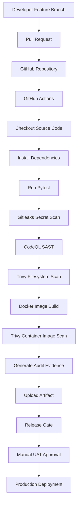

# CloudMart DevSecOps Pipeline


CloudMart is a sample e-commerce web application used to demonstrate an enterprise DevSecOps CI/CD pipeline built with GitHub Actions.

The project automates application testing, security scanning, containerization, governance, and release validation before deployment, following modern DevSecOps best practices.

# Project Overview

This project demonstrates how modern DevSecOps practices can secure the Software Development Life Cycle (SDLC).

Every code change automatically triggers the following automated DevSecOps pipeline:

- Build
- Unit Testing
- Secret Detection
- Static Code Analysis
- Vulnerability Scanning
- Docker Image Build
- Container Security Scan
- Audit Evidence Generation
- Release Gate Validation

# Technologies

| Category | Technology |
|----------|------------|
| Programming Language | Python |
| Web Framework | Flask |
| Version Control | Git |
| Repository | GitHub |
| CI/CD Platform | GitHub Actions |
| Unit Testing | Pytest |
| Secret Detection | Gitleaks |
| Static Application Security Testing (SAST) | CodeQL |
| Vulnerability Scanning | Trivy |
| Containerization | Docker |

---

# DevSecOps Pipeline Architecture




---

# Security Controls

- ✅ GitHub Actions CI Pipeline
- ✅ Automated Unit Testing (Pytest)
- ✅ Secret Detection (Gitleaks)
- ✅ Static Application Security Testing (CodeQL)
- ✅ Filesystem Vulnerability Scan (Trivy)
- ✅ Docker Image Build
- ✅ Container Image Vulnerability Scan (Trivy)
- ✅ Audit Evidence Artifact
- ✅ Release Gate Validation

# Governance & Compliance

CloudMart demonstrates enterprise DevSecOps governance by ensuring:

- Security testing is executed automatically.
- Secrets are detected before deployment.
- Source code is analysed using CodeQL.
- Filesystem and container vulnerabilities are scanned using Trivy.
- Docker images are built consistently.
- Audit evidence is generated for compliance.
- Release Gates verify that all quality, testing, and security checks have successfully completed before UAT approval.

# Docker

CloudMart is containerized using Docker to ensure a consistent runtime environment across development, testing, and production.

# Build Image

```bash
docker build -t cloudmart .
```

# Run Container

```bash
docker run -p 5000:5000 cloudmart
```

The application is exposed on port **5000**.

---

# Pipeline Status

The CloudMart DevSecOps pipeline successfully performs:

- Build
- Automated Unit Testing
- Secret Detection
- Static Code Analysis
- Filesystem Vulnerability Scanning
- Docker Image Build
- Container Image Vulnerability Scanning
- Audit Evidence Generation
- Release Gate Validation

Status: **Ready for UAT Approval**

---

# Future Enhancements

- Feature Branch workflow
- Pull Request approval
- Branch Protection Rules
- Terraform Infrastructure as Code
- HashiCorp Terraform Validate
- Azure Deployment
- Manual Production Approval
