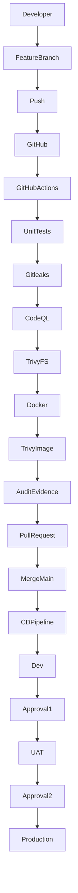

# 🚀 CloudMart DevSecOps Pipeline


---

#  Project Story

CloudMart is a fictional e-commerce platform designed to demonstrate how modern organizations can implement an enterprise-grade DevSecOps CI/CD pipeline using GitHub Actions.

Rather than focusing only on automation, this project demonstrates how secure software can move safely from development to production through automated testing, security validation, governance controls, deployment approvals, compliance evidence, and release quality gates.

The project follows a **Shift-Left Security** approach by embedding security throughout the Software Development Life Cycle (SDLC), enabling vulnerabilities and misconfigurations to be detected before deployment.

---

#  Project Objectives

This project was created to demonstrate practical implementation of:

- Continuous Integration (CI)
- Continuous Delivery (CD)
- Secure Software Development Lifecycle (SSDLC)
- Shift-Left Security
- DevSecOps Automation
- Governance & Compliance
- Deployment Traceability
- Audit Evidence Generation
- Release Gate Validation

---

#  Project Overview

Every source code change automatically triggers an enterprise DevSecOps pipeline consisting of:

- Source Code Checkout
- Dependency Installation
- Unit Testing
- Secret Detection
- Static Application Security Testing (SAST)
- Filesystem Vulnerability Scanning
- Docker Image Build
- Container Vulnerability Scanning
- Pull Request Validation
- Manual Deployment Approval
- Deployment Evidence Generation
- Release Gate Validation

---

#  Technologies

| Category | Technology |
|-----------|------------|
| Programming Language | Python 3.11 |
| Web Framework | Flask |
| Version Control | Git |
| Repository | GitHub |
| CI/CD Platform | GitHub Actions |
| Unit Testing | Pytest |
| Secret Detection | Gitleaks |
| Static Application Security Testing (SAST) | GitHub CodeQL |
| Vulnerability Scanning | Trivy |
| Containerization | Docker |
| Deployment Control | GitHub Environments |
| Compliance Evidence | GitHub Artifacts |

---

Another fantastic one for README:

```markdown
#  CloudMart DevSecOps Architecture

```text
┌──────────────────┐
│    Developer     │
└────────┬─────────┘
         │
         ▼
┌──────────────────┐
│  Feature Branch  │
└────────┬─────────┘
         │
         ▼
┌──────────────────────────────────────┐
│          GitHub Actions CI           │
├──────────────────────────────────────┤
│  ✓ Pytest Unit Testing               │
│  ✓ Gitleaks Secret Detection         │
│  ✓ CodeQL SAST                       │
│  ✓ Trivy Filesystem Scan             │
│  ✓ Docker Image Build                │
│  ✓ Trivy Container Scan              │
│  ✓ Audit Evidence Artifact           │
└────────┬─────────────────────────────┘
         │
         ▼
┌──────────────────┐
│  Pull Request    │
└────────┬─────────┘
         │
         ▼
┌──────────────────┐
│   Main Branch    │
└────────┬─────────┘
         │
         ▼
┌──────────────────────────────────────┐
│          GitHub Actions CD           │
├──────────────────────────────────────┤
│  Dev  →  UAT  →  Production          │
│  Evidence generated at every stage   │
│  Manual approvals before release     │
└────────┬─────────────────────────────┘
         │
         ▼
┌──────────────────┐
│ Release Complete │
└──────────────────┘

#  DevSecOps Delivery Flow

```text
Developer
   │
   │  Push code to feature branch
   ▼
Feature Branch
   │
   │  CI pipeline starts automatically
   ▼
Continuous Integration
   │
   ├── Unit Testing
   ├── Secret Detection
   ├── CodeQL SAST
   ├── Trivy Filesystem Scan
   ├── Docker Image Build
   ├── Trivy Container Scan
   └── Audit Evidence
   │
   │  All checks must pass
   ▼
Pull Request
   │
   │  Review and merge into main
   ▼
Main Branch
   │
   │  CD pipeline starts automatically
   ▼
Continuous Delivery
   │
   ├── Deploy to Dev
   ├── Generate Dev Evidence
   ├── Manual Approval
   ├── Deploy to UAT
   ├── Generate UAT Evidence
   ├── Manual Approval
   ├── Deploy to Production
   └── Generate Production Evidence
   │
   ▼
Release Complete

#  Enterprise DevSecOps Pipeline



---

#  Security Controls

| Security Control | Tool |
|------------------|------|
| Unit Testing | Pytest |
| Secret Detection | Gitleaks |
| Static Code Analysis | CodeQL |
| Filesystem Vulnerability Scan | Trivy |
| Container Image Scan | Trivy |
| Docker Build Validation | Docker |
| Release Validation | GitHub Actions |
| Deployment Approval | GitHub Environments |

---

#  Governance & Compliance

CloudMart incorporates governance and compliance controls commonly found in enterprise DevSecOps environments.

## Governance

- Pull Request based development
- Feature branch workflow
- Automated CI validation
- Manual deployment approval
- Environment protection
- Deployment traceability
- Controlled production release

## Compliance

The pipeline automatically generates evidence including:

- Commit SHA
- Branch Name
- Deployment Timestamp
- Deployment Environment
- Pipeline Status
- Build Validation
- Security Scan Results

These artifacts provide traceability for governance reviews, security audits and compliance reporting.

---

#  KPI Dashboard

The following KPIs are used to measure pipeline quality and operational performance.

| KPI | Target |
|------|--------|
| Unit Test Pass Rate | 100% |
| Secrets Detected | 0 |
| Critical Vulnerabilities | 0 |
| High Vulnerabilities | 0 |
| Successful CI Builds | >95% |
| Successful Deployments | >95% |
| Audit Evidence Generated | 100% |
| Production Deployment Success | 100% |

---

And this one for **Governance + KPI Lead**:

```markdown
#  Governance, Compliance & KPI Model

```text
                 ┌──────────────────────┐
                 │  Governance Lead      │
                 │  Policy & Approval    │
                 └──────────┬───────────┘
                            │
                            ▼
┌──────────────┐    ┌──────────────────────┐    ┌──────────────┐
│ Developer    │───▶│ DevSecOps Pipeline   │───▶│ KPI Lead      │
│ Code Change  │    │ CI/CD Automation     │    │ Metrics       │
└──────────────┘    └──────────┬───────────┘    └──────────────┘
                            │
                            ▼
                 ┌──────────────────────┐
                 │ Compliance Evidence  │
                 │ Artifacts + Trace    │
                 └──────────────────────┘

#  Repository Structure

```text
CloudMart-DevSecOps-Pipeline
│
├── .github
│   └── workflows
│       ├── ci.yml
│       └── cd.yml
│
├── app
├── docs
├── src
├── tests
│
├── Dockerfile
├── requirements.txt
├── README.md
└── LICENSE
```

---

#  Docker

Build the Docker image

```bash
docker build -t cloudmart .
```

Run the application

```bash
docker run -p 5000:5000 cloudmart
```

Access the application

```
http://localhost:5000
```

---

#  Deployment Strategy

CloudMart follows a controlled deployment strategy.

| Stage | Description |
|---------|-------------|
| CI | Build, Test, Security Validation |
| Pull Request | Code Review |
| Development | Automatic Deployment |
| UAT | Manual Approval |
| Production | Manual Approval |

---

#  Pipeline Status

Current implementation includes:

- ✅ Continuous Integration
- ✅ Continuous Delivery
- ✅ Unit Testing
- ✅ Secret Detection
- ✅ Static Code Analysis
- ✅ Filesystem Vulnerability Scanning
- ✅ Docker Image Build
- ✅ Container Security Scanning
- ✅ Audit Evidence Generation
- ✅ Deployment Evidence Generation
- ✅ Release Gate Validation
- ✅ Manual Deployment Approval

**Current Status**

🟢 Production Ready (Demonstration Environment)

---

#  Future Roadmap

The project will continue evolving with additional DevSecOps capabilities.

- Branch Protection Rules
- Required Pull Request Reviews
- Dependabot
- Software Bill of Materials (SBOM)
- Docker Image Signing (Cosign)
- Terraform Infrastructure as Code
- OWASP ZAP Dynamic Application Security Testing
- SonarQube Code Quality
- Kubernetes Deployment
- Azure Deployment
- Slack / Microsoft Teams Notifications
- Security Dashboard
- Prometheus Monitoring
- Grafana Visualization

---

#  Lessons Learned

This project strengthened my understanding of how DevSecOps extends beyond automation.

By combining CI/CD, security testing, governance, compliance, audit evidence and deployment approvals into a single workflow, I gained practical experience in implementing secure software delivery aligned with enterprise best practices.

---

#  Author

**YLHASH**

Cybersecurity | DevSecOps | Security Engineering

Proud human to six furkids 🐾, coffee enthusiast and always curious about improving security one step at a time.
