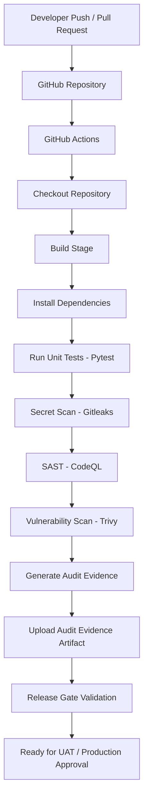

# CloudMart-DevSecOps-Pipeline

DevSecOps Capstone Project demonstrating a secure CI/CD pipeline using GitHub Actions with automated testing, security scanning, governance, and compliance.

---

## 🚀 DevSecOps Pipeline Architecture

---

## Security Controls

- ✅ GitHub Actions CI Pipeline
- ✅ Pytest Unit Testing
- ✅ Gitleaks Secret Detection
- ✅ CodeQL Static Application Security Testing (SAST)
- ✅ Trivy Vulnerability Scanning
- ✅ Audit Evidence Generation
- ✅ Artifact Upload
- ✅ Release Gate Validation

---

## Governance & Compliance

This pipeline demonstrates enterprise DevSecOps practices by ensuring:

- Security
